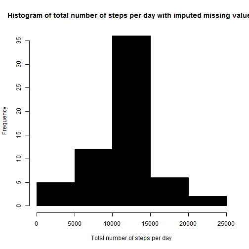

# My Peer Assessment 1 Reproducible research.
===================================================================
## Loading the data.

Here is a code for reading in the dataset in .csv format.

```r
data <- read.csv("activity.csv")
```

## Number of steps per day.

Total number of steps taken each day.

```r
good <- na.omit(data)
stepsPerDay <- aggregate(steps ~ date, good, sum)
```
Histogram of total number of steps taken each day.

```r
hist(stepsPerDay$steps, col=1, mar=c(1, 1, 1, 0), main="Histogram of total number of steps taken each day", xlab="Total number of steps in a day")
```

 


Mean and median of total number of steps taken per day.

```r
mean(stepsPerDay$steps)
```

```
## [1] 10766
```

```r
median(stepsPerDay$steps)
```

```
## [1] 10765
```

## Average daily activity pattern.

Making a time series plot of the 5-minute interval and the average number od steps taken, averaged across all days.

```r
intervalSteps <- aggregate(steps ~ interval, good, mean)
plot(intervalSteps$interval, intervalSteps$steps, type="l", col=1, mar=c(1, 1, 1, 0), main="Average number of steps taken, averaged across all days", xlab="5-minute interval", ylab="Average number of steps")
```

 

Which interval has the maximum average number of steps?

```r
maxAvrgSteps <- which.max(intervalSteps$steps)
intervalSteps [maxAvrgSteps, ]
```

```
##     interval steps
## 104      835 206.2
```
The interval 835 has the maximum average number of steps (=206.2). 

## Imputing missing values.

The total number of missing values (NA) in the dataset.

```r
NArows <- data[!complete.cases(data),]
nrow(NArows)
```

```
## [1] 2304
```
In this dataset exists 2304 rows with missing values.


Creating a new dataset that is equal to the original dataset but with the imputing missing data.

A strategy for imputing missing data.

```r
for (i in 1:nrow(data)) {
    if (is.na(data$steps[i])) {
        intervalValue <- data$interval[i]
        rowID <- which(intervalSteps$interval == intervalValue)
        stepsValue <- intervalSteps$steps[rowID]
        data$steps[i] <- stepsValue
    }
}

stepsPerDateImputed <- aggregate(steps ~ date, data, sum)
```


Creating a histogram of the total number of steps taken each day AFTER missing values were imputed.

```r
hist(stepsPerDateImputed$steps, col=1, mar=c(1, 1, 1, 0), main="Histogram of total number of steps per day with imputed missing values", xlab="Total number of steps per day")
```

 

Calculating the mean and median of total number of steps taken per day. 

```r
mean(stepsPerDateImputed$steps)
```

```
## [1] 10766
```

```r
median(stepsPerDateImputed$steps)
```

```
## [1] 10766
```

Comparing the values of mean and median of total number of steps taken per day before and after imputing missing values.

```r
# Before and after imputing missing values for mean: 
mean(stepsPerDay$steps)
```

```
## [1] 10766
```

```r
mean(stepsPerDateImputed$steps) 
```

```
## [1] 10766
```

```r
# Before and after imputing missing values for median:
median(stepsPerDay$steps)
```

```
## [1] 10765
```

```r
median(stepsPerDateImputed$steps)
```

```
## [1] 10766
```

The above calculations show that the values for mean do not differ before and after imputing missing values.
The values for median differ but insignificantly.

From the above comparisons, I can conclude that the impact of imputing missing data on the estimates of the total daily number of steps in not signigicant. 

## The differences in activity patterns between weekdays and weekends.

To notice the difference (if any), first I have to "label" the days as weekdays or weekends.

```r
data$date <- as.Date(data$date, "%Y-%m-%d")

data$day <- weekdays(data$date)
data$dayTypeCol <- c("weekday")

for (i in 1:nrow(data)) {
    if (data$day[i] == "Saturday" || data$day[i] == "Sunday") {
        data$dayTypeCol[i] <- "weekend"
    }
}

data$dayTypeCol <- as.factor(data$dayTypeCol)
```

To get average number of steps in an interval across all days, I aggregated the steps over the interval.

```r
stepsPerIntervalImputed <- aggregate(steps ~ interval + dayTypeCol, data, mean)
```

## Making a panel plot comparing the average number of steps taken per 5-minute interval averaged across weekdays and weekends.

```r
library(ggplot2)
```

```
## Warning: package 'ggplot2' was built under R version 3.1.1
```

```r
qplot(interval, steps, data = stepsPerIntervalImputed, geom = c("line"), xlab = "Interval", ylab = "Number of steps", main = "") + facet_wrap(~ dayTypeCol, ncol=1)
```

 

